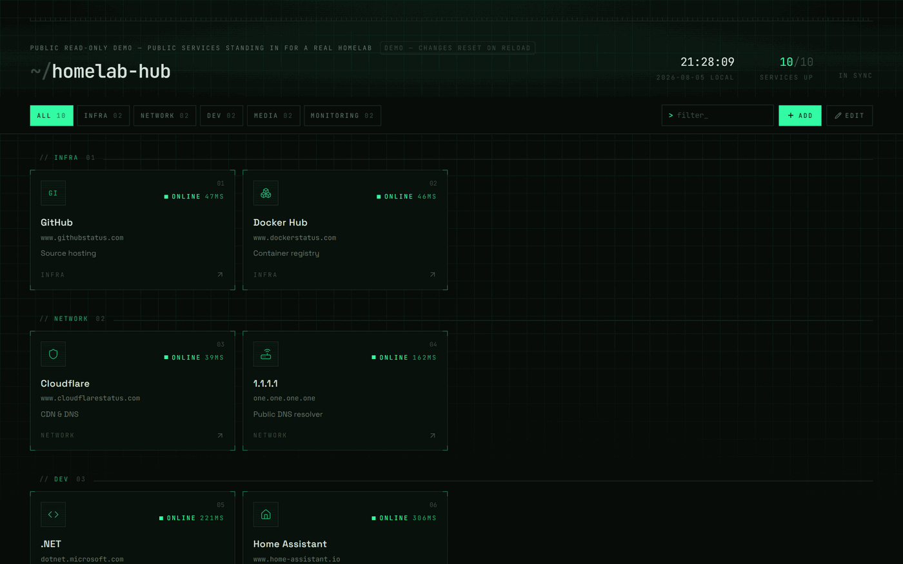

# homelab-hub

[](https://github.com/lukislp/homelab-hub/actions/workflows/ci-cd.yml)
[](https://github.com/lukislp/homelab-hub/releases)
[](LICENSE)
[](https://nodejs.org/)

A self-hosted link dashboard for your homelab with a **terminal·tech look**: all your services at a glance, live status with latency, opens in a new tab on click. Runs as a **single container** on k3s behind **NGINX Gateway Fabric** (Gateway API / HTTPRoute).

**[Live demo](https://homelabhub-demo.lktec.org)** — read-only, running the actual
`ghcr.io/lukislp/homelab-hub:latest` image published by this repo's own CI/CD pipeline, seeded
with public services in place of a real homelab. Changes apply locally in your browser but
are never saved (reload resets it).



## Features

- **Manage links in the UI** — create, edit, delete (two-step confirmation). Persisted as JSON on a PVC, writes are atomic.
- **Live status** — the backend probes all services server-side every 15s (no CORS, self-signed certificates are fine). **Any** HTTP response counts as online (401/403/302 included — the service is clearly alive). Displayed with latency: `ONLINE 23MS`.
- **Categories & filtering** — grouped sections, filter chips, text filter. New categories are created directly from the form; empty categories disappear automatically.
- **Drag & drop** — reorder cards within a category, and reorder entire categories via a grip handle on the section header (its own drag handle, separate from the cards). Order is persisted either way. Cards remain plain links (8px activation threshold).
- **Icons** — auto favicon (via a backend proxy, avoiding mixed-content/self-signed blocks), a curated icon set, or a monogram fallback.
- **Works offline** — fonts are bundled, no CDN, no cloud calls. Runs entirely on your LAN.

## Architecture

```
Browser ──> NGINX Gateway (HTTPRoute) ──> Service :80 ──> Pod :8080
                                                      node server/server.mjs
                                                      ├── dist/  (built SPA)
                                                      ├── /api/data      GET/PUT (validation, atomic writes)
                                                      ├── /api/status    probe cache (sweep every 15s)
                                                      ├── /api/icon/:id  favicon proxy with cache
                                                      └── /api/health    k8s probes
                                                      /data/links.json   (PVC, local-path)
```

The server has **zero runtime dependencies** (Node builtins only). Frontend: Vite + React 19 + TypeScript + Tailwind v4 + motion + dnd-kit + zustand.

## Local development

```bash
npm install
npm run server   # API on :8080, data in ./data/links.json
npm run dev      # Vite dev server, proxies /api -> :8080
```

On first start, `links.json` is seeded with example services (shown as offline until you replace them with your real ones).

## Build & image

```bash
docker build -t homelab-hub:0.1.0 .
```

**Note for ARM (Raspberry Pi etc.):** build on x86 with
`docker buildx build --platform linux/arm64 -t homelab-hub:0.1.0 --load .`

### Option A — with your own registry

```bash
docker tag homelab-hub:0.1.0 registry.example.com/homelab-hub:0.1.0
docker push registry.example.com/homelab-hub:0.1.0
# then update the image reference in k8s/deployment.yaml accordingly
```

### Option B — without a registry (import directly into k3s)

```bash
docker save homelab-hub:0.1.0 | ssh <k3s-node> "sudo k3s ctr images import -"
```

`k3s ctr` writes directly into k3s's containerd instance. With multiple nodes: import on **every** node (or pin the pod via nodeSelector — the PVC binds it to one node anyway). Important: the deployment uses `imagePullPolicy: IfNotPresent` with a **pinned tag** — never `:latest`, or k3s will try to pull it and find nothing.

## Deployment

```bash
kubectl apply -k k8s/
```

Before applying, **update two placeholders** in `k8s/httproute.yaml`:

1. `spec.parentRefs` → name + namespace of your Gateway object (`kubectl get gateway -A`)
2. `spec.hostnames` → your desired hostname (e.g. `hub.example.com`)

### ⚠ The cross-namespace trap (the most common pitfall)

The HTTPRoute lives in the `homelab-hub` namespace, while your Gateway is probably elsewhere. Gateway listeners by default only allow routes **from their own namespace** (`allowedRoutes.namespaces.from: Same`) — the route is then **silently ignored**. The listener on the Gateway needs:

```yaml
listeners:
  - name: http
    port: 80
    protocol: HTTP
    allowedRoutes:
      namespaces:
        from: All   # or a selector
```

Diagnosis: `kubectl describe httproute -n homelab-hub homelab-hub` → condition `Accepted: False`, reason `NotAllowedByListeners`.

After that, DNS: `hub.example.com` needs to point at the Gateway's IP (AdGuard/Pi-hole rewrite or a DNS record).

## Usage

`+ ADD` registers a service (a URL without a scheme automatically gets `http://`). `EDIT` toggles edit mode: cards then open the form instead of the link, and each section gets an "ADD TO …" tile. Reorder via drag & drop (disabled while a text filter is active). `>` filters by name, URL, description, and category; `Esc` clears the field.

**Status probes:** the click URL is probed — or the `STATUS URL` (under ADVANCED) if the click URL isn't reachable from inside the cluster (split DNS, hairpin NAT). Can be disabled per service (`NO PROBE`). Timeout 5s, error/timeout ⇒ `OFFLINE`.

## Data & backup

Everything lives in **one file**: `/data/links.json` on the PVC.

```bash
# Backup
kubectl exec -n homelab-hub deploy/homelab-hub -- cat /data/links.json > backup-links.json
# Restore (copy the file back and restart the pod)
kubectl cp backup-links.json homelab-hub/<pod>:/data/links.json
kubectl rollout restart -n homelab-hub deploy/homelab-hub
```

If the file is missing, it's recreated with example data. If it's corrupt, it's backed up to `links.json.invalid-<timestamp>` and reseeded — nothing is lost.

## Security

The dashboard **deliberately has no authentication** — it's meant for internal use on your homelab. Don't expose it to the internet; if you must, secure it at the Gateway (e.g. an auth filter/OAuth proxy in front of it). The container runs non-root with `readOnlyRootFilesystem`, dropped capabilities, and seccomp `RuntimeDefault`.

## Tests & scripts

```bash
npm run build          # TypeScript check + production build
npm run smoke          # API smoke test (endpoints, limits, traversal, probe sweep)
npm run e2e            # headless browser test (create, filter, delete) — needs Chromium
npm run shots          # screenshots with demo data                     — needs Chromium
npm run validate:k8s   # manifest checks + kubeconform (incl. Gateway API schema)
```

`e2e`/`shots` look for Chromium at `/opt/pw-browsers` or via `PW_CHROMIUM=/path/to/chrome`.

## Troubleshooting

| Symptom | Cause / fix |
| --- | --- |
| Route not responding, `Accepted: False / NotAllowedByListeners` | Gateway listener doesn't allow other namespaces → `allowedRoutes.namespaces.from: All` (see above) |
| Pod stuck in `Pending` | Normal for local-path (`WaitForFirstConsumer`) until scheduling; otherwise `kubectl describe pvc -n homelab-hub` |
| `ErrImagePull` / `ImagePullBackOff` | Image not present on the node (Option B: import on every node) or tag mismatch with `kustomization.yaml` |
| Service shows `OFFLINE` but is reachable | Click URL not resolvable/reachable from inside the cluster → set `STATUS URL` (ADVANCED) to an internal address |
| Favicon missing | Service doesn't serve `/favicon.ico` → automatic fallback to monogram; alternatively pick an icon set |
| `WRITE FAILED` in the header | PVC full or not writable → check `kubectl logs`, `fsGroup: 1000` must be set in the deployment |

## Project structure

```
homelab-hub/
├── server/server.mjs      # complete backend server (zero deps)
├── src/                   # React frontend (Vite, Tailwind v4)
├── scripts/               # smoke / e2e / screenshots / k8s validation
├── k8s/                   # namespace, PVC, deployment, service, HTTPRoute, kustomization
├── Dockerfile             # multi-stage build (node:22-alpine)
└── data/                  # local only (dev) — in-cluster, /data lives on the PVC
```

## License

MIT — see [LICENSE](LICENSE).
